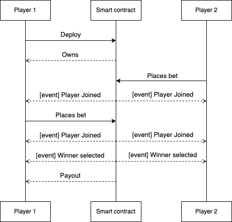

# VU Blockchain smart contract

A custom smart contract implementation for Vilnius University "Blockchain technologies" course.

## Usage

In order to run this smart contract in development mode, the following commands must be executed in parallel.

```bash
ganache
npm run dev
```

## Smart contract flow



## Smart contract idea

This contract is aims to create decentralized lottery, which cannot be rigged by design. For now, this contract allows only two players to participate. If player wants to join, he must provide his number guess - either 0 or 1. When both numbers are provided, the contract generates a winner based on pseudo-random numbers.